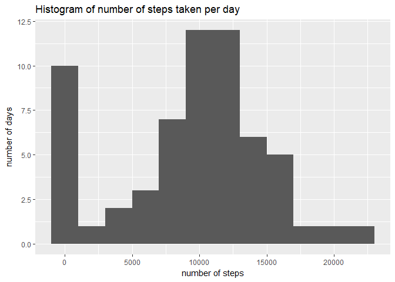
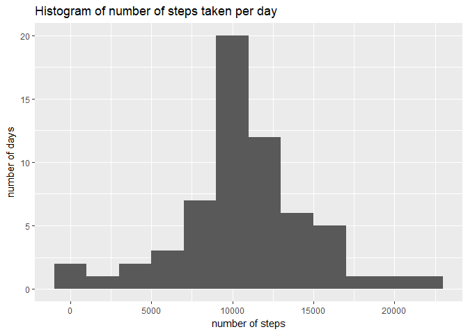
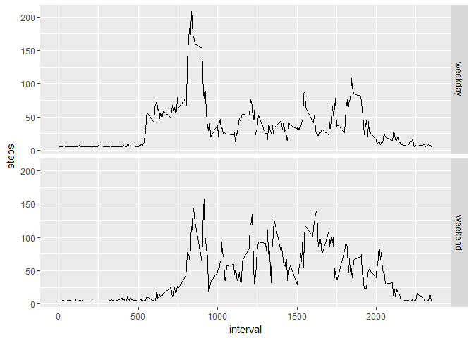

Import libraries. "ggplot2" for plotting and "Hmisc" for using impute() function.

```r
library(ggplot2)
library(Hmisc)
```


## Loading and preprocessing the data
**1. Load the data (i.e. read.csv())**  
Unzip the "activity.zip" and load "activity.csv" into "activity" variable. 

```r
temp <- unzip("activity.zip")
activity <- read.csv(temp)
```

**2. Process/transform the data (if necessary) into a format suitable for your analysis**  
Convert the "date" column from "factor" class to "Date" class for further processing.

```r
activity$date <- as.Date(activity$date)
```


## What is mean total number of steps taken per day?
**1. Make a histogram of the total number of steps taken each day**  
Sum the number of steps taken each day and plot it as histogram. The histogram shows number of days for each range of steps. Each range is of 2000 steps which is defined by the binwidth.

```r
totalStepsByDay <- with(activity, tapply(steps, date, sum, na.rm = TRUE))
qplot(totalStepsByDay, xlab = "number of steps", ylab = "number of days", 
      main="Histogram of number of steps taken per day", binwidth = 2000)
```

<!-- -->

**2. Calculate and report the mean and median total number of steps taken per day**

```r
meanVal <- mean(totalStepsByDay)
medianVal <- median(totalStepsByDay)
```
The mean of total number of steps taken per day is **9354.2295082**  
The median of total number of steps taken per day is **10395**


## What is the average daily activity pattern?
**1. Make a time series plot (i.e. type = "l") of the 5-minute interval (x-axis) and the average number of steps taken, averaged across all days (y-axis)**  
Average number of steps taken at each 5-minute time interval

```r
averageStepsPerTimeBlock <- aggregate(steps ~ interval, activity, mean, na.rm = TRUE)
ggplot(data = averageStepsPerTimeBlock, aes(x=interval, y=steps)) + geom_line()
```

<!-- -->

**2. Which 5-minute interval, on average across all the days in the dataset, contains the maximum number of steps?**

```r
maxsteps_interval <- averageStepsPerTimeBlock$interval[which.max(averageStepsPerTimeBlock$steps)]
```
maximum number of steps are taken at **835**th interval


## Imputing missing values
**1. Calculate and report the total number of missing values in the dataset (i.e. the total number of rows with NAs)**

```r
missingVals <- sum(is.na(activity$steps))
```
Total Number of missing values are **2304**

**2. Devise a strategy for filling in all of the missing values in the dataset. The strategy does not need to be sophisticated. For example, you could use the mean/median for that day, or the mean for that 5-minute interval, etc.  
3. Create a new dataset that is equal to the original dataset but with the missing data filled in.  
4. Make a histogram of the total number of steps taken each day and Calculate and report the mean and median total number of steps taken per day. Do these values differ from the estimates from the first part of the assignment? What is the impact of imputing missing data on the estimates of the total daily number of steps?**  
Create a new dataset and impute the missing values by taking mean 

```r
activityImputed <- activity
activityImputed$steps <- impute(activity$steps, fun=mean)
```


```r
totalStepsByDay <- with(activityImputed, tapply(steps, date, sum, na.rm = TRUE))
qplot(totalStepsByDay, xlab = "number of steps", ylab = "number of days", 
      main="Histogram of number of steps taken per day", binwidth = 2000)
```

<!-- -->


```r
meanVal <- mean(totalStepsByDay)
medianVal <- median(totalStepsByDay)
```
The mean of total number of steps taken per day is **1.0766189\times 10^{4}**  
The median of total number of steps taken per day is **1.0766189\times 10^{4}**  
Yes, these values are differ from the estimates from the first part.  
By imputing missing data, the mean and median is increased a little bit.


## Are there differences in activity patterns between weekdays and weekends?
**1. Create a new factor variable in the dataset with two levels – “weekday” and “weekend” indicating whether a given date is a weekday or weekend day.**  
Create a new column describing whether the current record is weekday or weekend.

```r
activityImputed$day <- ifelse(weekdays(activityImputed$date) == "Saturday" | 
                                weekdays(activityImputed$date) == "Sunday", 'weekend', 'weekday')
```

**2. Make a panel plot containing a time series plot (i.e. type = "l") of the 5-minute interval (x-axis) and the average number of steps taken, averaged across all weekday days or weekend days (y-axis).**  
Plot the Time Series for both weekday and weekend

```r
averageStepsPerTimeBlock <- aggregate(steps ~ interval + day, activityImputed, mean, na.rm = TRUE)
ggplot(data = averageStepsPerTimeBlock, aes(x=interval, y=steps)) + geom_line() + facet_grid(day ~ .)
```

<!-- -->
  
Yes, there is a difference in the patterns on weekday and weekend.
